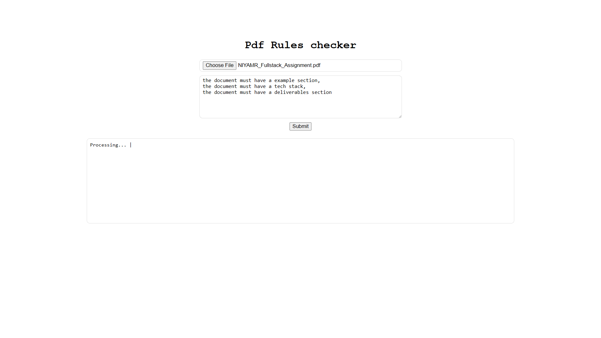
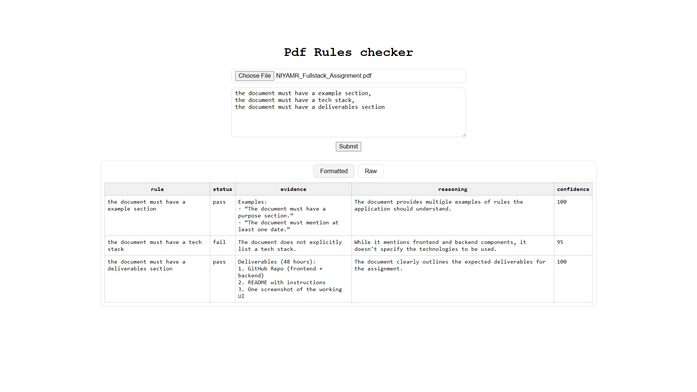
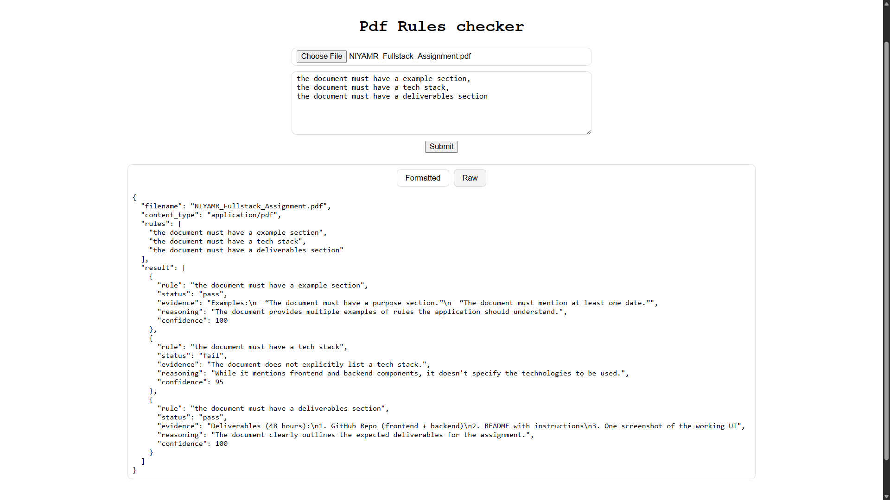

# Pdf Rules Checker 

This project extracts the text from a PDF file and then checks the text against a set of rules using the Large Language Model (LLM) provided by Gemini. The result is a JSON object containing the rule, status, evidence, reasoning and confidence level for each rule.

---

# Screenshots
---




---

# Installation

Follow the steps below to set up and run the Python project.

---

## 1. Clone or Download the Project

```bash
git clone https://github.com/IsayAyase/pdf-llm-rule-check
cd pdf-llm-rule-check
```

---

## 2. Create and Activate a Virtual Environment

### **Windows**

```bash
python -m venv .venv
.venv\Scripts\activate
```

### **MacOS / Linux**

```bash
python3 -m venv .venv
source .venv/bin/activate
```

---

## 3. Create a `.env` File

Inside the project root, create a file named **`.env`** and add:

```env
GEMINI_KEY=your_api_key_here
```

Make sure to replace `your_api_key_here` with your actual Gemini API key.

---

## 4. Install Dependencies

Run the command:

```bash
pip install -r requirements.txt
```

This will install all necessary packages for the project.

---

## 5. Run the Project

Use the following command to start:

```bash
python main.py
```

(Or `python3 main.py` depending on your system.)

---
